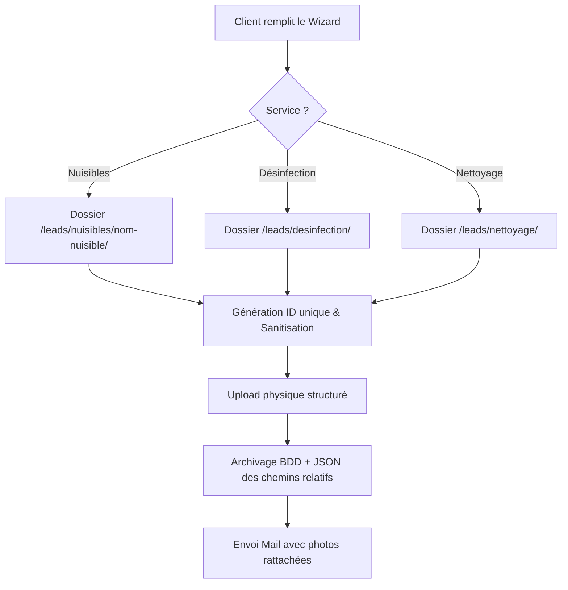

# 📖 Master Cahier des Charges : Plateforme ESEND V4
> **Version :** 4.0 (Avril 2026)  
> **Statut :** Document de Référence de l'Ecosystème  
> **Acteurs :** Steve (Owner), Antigravity (IA Architect)  
> **Tech Doc :** [TECHNICAL_DOCUMENTATION.md](TECHNICAL_DOCUMENTATION.md)

---

## 📑 Sommaire
1. [Vision & Positionnement](#1-vision--positionnement)
2. [Identité Visuelle & UX](#2-identité-visuelle--ux)
3. [Architecture Multi-Hubs](#3-architecture-multi-hubs)
4. [Tunnel de Conversion (FormWizard)](#4-tunnel-de-conversion-formwizard)
5. [Ecosystème Backend & API](#5-ecosystème-backend--api)
6. [Administration & Mini-CRM](#6-administration--mini-crm)
7. [SEO & Performance](#7-seo--performance)

---

## 1. Vision & Positionnement
ESEND est une plateforme multiservices d'expertise dans le traitement des nuisibles, la désinfection et le nettoyage de précision. Contrairement aux sites vitrines classiques, ESEND se positionne comme un **Assistant Digital Expert** alliant efficacité technique et esthétique premium (type Luxe/Pro).

### Objectifs Clés :
- **Conversion Haute Performance** : Transformer chaque visiteur en lead qualifié.
- **Transparence Expertise** : Éduquer le client via le "Journal de l'Expert".
- **Automatisation Administrative** : Réduire le temps de gestion des dossiers via le Mini-CRM.

---

## 2. Identité Visuelle & UX
L'interface utilise les codes du **Design UI Moderne** (Glassmorphism, animations fluides).

- **Code Couleur Maître** : Rouge ESEND (`#dc2626`) sur fonds sombres/propres.
- **Typographie** : Sans-serif grasse, majuscules pour les titres (impact maximal).
- **Composant `Reveal`** : Utilisation systématique de Framer Motion pour des entrées progressives (staggered animations).
- **Règle de Lisibilité** : Malgré le thème sombre général, les formulaires critiques (Wizard) conservent un fond blanc pur (`bg-white`) pour une clarté absolue.

---

## 3. Architecture Multi-Hubs
Le site est structuré en trois piliers verticaux :

### A. Hub Nuisibles (Pest Hub)
- **Cible** : Rats, Souris, Cafards, Punaises de lit, Puces, Guêpes, Fourmis.
- **Principe éthique** : Signalement clair que les Abeilles ne sont pas traitées (renvoi vers apiculteurs).
- **Structure des fiches** : Description, Risques, Traitement, FAQ spécifique et CTA dynamique.

### B. Hub Désinfection
- **Design** : Accents Cyan (`emerald/cyan`).
- **Focus** : Protocoles virucides, bio-sécurité, milieux sensibles.

### C. Hub Nettoyage de Précision
- **Design** : Accents Indigo (`indigo`).
- **Focus** : Vitrerie à l'eau pure, nettoyage haute performance.

---

## 4. Tunnel de Conversion (FormWizard)
Le formulaire de devis est le cœur battant du site. Il est conçu pour être **autonome**.

### Étapes du Tunnel :
1. **Besoin** : Sélection du service et du nuisible concerné.
2. **Détails** : "Placeholder" dynamique (ex: *"Dites-nous si vous voyez des traces noires..."* pour les cafards).
3. **Multimédia** : Dépôt de 3 photos maximum, compressées en temps réel sur le navigateur pour ne pas saturer le serveur.
4. **Localisation** : Code Postal et Ville avec validation.
5. **Contact** : Validation stricte du téléphone (FR) et type de client (Particulier/Pro).

---

## 5. Ecosystème Backend & API
### Technologie
- **Langage** : PHP 8+ (Hostinger).
- **Emailing** : PHPMailer avec fonction `mail()` native optimisée.
- **Base de Données** : MySQL (PDO).

### Logique de Suivi & Stockage (Solution Hybride Pro)
Chaque formulaire génère un **Tracking ID** unique : `ES-AAMM-NNN`. Les médias associés suivent une stratégie de classement intelligent :
- **Organisation Physique** : Stockage local structuré par métier sur le serveur : `/public/uploads/leads/[service]/[nuisible]/`.
- **Référencement BDD** : La base de données stocke le chemin relatif complet, permettant une migration transparente vers un Cloud (CDN) à l'avenir.
- **Sanitisation** : Les noms de dossiers sont automatiquement nettoyés (minuscules, sans accents, espaces remplacés par des tirets).

---

## 6. Administration & Mini-CRM
L'administration permet un pilotage total sans connaissances techniques.

### modules Clés :
- **Journal Expert** : Studio de création avec IA (Gemini) pour rédiger des articles optimisés.
- **Réalisations** : Gestionnaire de projets terrain (avant/après).
- **LeadManager (CRM)** : 
  - **Statuts** : Nouveau, Contacté, Terminé, Annulé.
  - **Automatisation Zéro-Saisie** : Un clic sur "Appeler" dans l'admin passe automatiquement le dossier en "Contacté".

---

## 7. SEO & Performance
- **Image Compression** : Utilisation de `webp` et redimensionnement auto.
- **Metadata Dynamique** : Tags SEO injectés via `DynamicSEO.jsx`.
- **Architecture de contenu** : Une page par nuisible + URL canonique.

## 8. Sécurité & Protection des Données
La plateforme ESEND applique des protocoles de sécurité de niveau industriel :
- **Hachage des Mots de Passe** : Transition totale vers **Argon2id** (Standard 2026) pour tous les accès administratifs. Aucune donnée sensible n'est stockée en clair.
- **Migration Sécurisée** : Utilisation d'un système de migration douce (Lazy Migration) garantissant la mise à jour des comptes sans interruption de service.
- **Conformité RGPD** : Verrouillage de la collecte de données par consentement explicite et politique de transparence totale sur l'usage des informations.

---

## 9. Business Intelligence & IA Strategy
Le Dashboard ESEND intègre un moteur de **Market Intelligence** pour transformer les données web en opportunités commerciales.

### Composants Clés :
- **Market Strategy Advisor** : Analyseur de tendances en temps réel (via Apify) focalisé sur le bassin de Menton et de la Riviera (06).
- **Priorisation Hyper-Locale** : Les données de Menton sont traitées en priorité 1 pour les alertes sanitaires (nuisibles) et les opportunités SEO.
- **Aide à la Décision IA** : Utilisation de modèles de langage (LLM) pour transformer les pics de recherche Google Trends en recommandations concrètes (ex: *"Hausse des fourmis à Menton : Préparez une campagne de prévention Facebook"*).

---

> **Note de l'IA Architect :** Ce document doit être la base de toute future itération. Il garantit la cohérence entre le design frontal et la puissance du backend.
